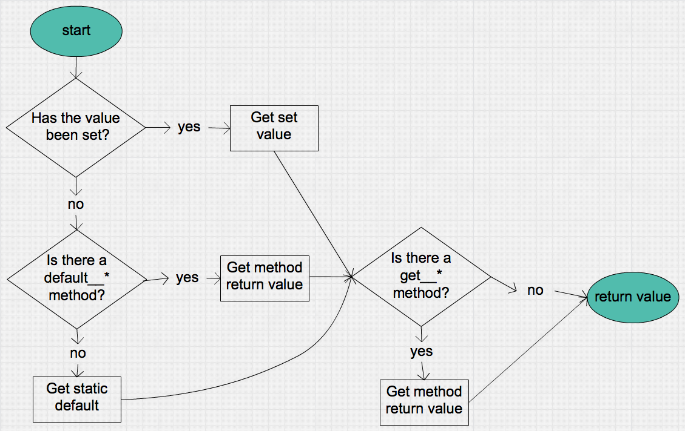

# Object Properties

A render pattern encapsulates the render array into a class and then exposes only those properties that may change across instances.

To set a property you have two options: set the value when you instantiate the pattern, or set it on the pattern directly.

In these examples I have defined a render pattern as a PHP class `Drupal\render_pattern\Pattern\Headline` located in my default theme's folder as _{theme dir}/render\_patterns/Headline.php_.

## Set the Property on Instantiation

    $pattern = render_patterns_get('Headline', [
      'title' => 'Hello World',
    ]);
    
## Set the Property Directly

    $pattern = render_patterns_get('Headline')
    $pattern->title = 'Hello World';

## Property Validation

When you try to set a property value, it will be validated against the schema.  If the property is not allowed, or it's value is not valid then an error situation occurs.

How this manifests depends on when you're setting the property.  On instantion, as in the first example, the error is handled by drupal error messages; as well as the object returned is a markup render array with the error message.  So if you render the object, you will also see the error message.
  
When setting directly, i.e., `$pattern->title`, an exception is thrown. 

## Default Values

Default values will only be returned for a property if the property has not been set.  Once set, the default mechanisms as described below do not apply.

**Default values, whether static or dynamic, are not validated per the schema, so be careful.**

### Static Default Values

Set your default values in `pattern::$properties`, using the key `default`, something like this:
    
    protected $properties = [
      'title' => [
        'type' => 'string',
        'default' => 'Title Goes Here',
      ],
    ];      

### Dynamic Default Values

If you need to provide non-static values for a property, use a method that follows the naming convention of `default_{property}`, e.g. `default__title`.  When using this approach, ask your self if the value can be cached or not.  If it cannot be cached, that is it should be called every time the property is requested and has not been overloaded then simply return a value in the method.  However if the method needs to be called only once and then it's value can be cached, return the value wrapped in `Cacheable::value()` as seen here.

      protected function default__tag() {
        return Cacheable::value('h3');
      }

In this example the value should not be cached and so you'd do like shown below.  This is an obvious use case because you want `$pattern->now` to always return the current time.

      protected function default__now() {
        return time();
      }        

## Get the Value

Getting the value goes through a series of steps.  Refer to this flowchart for more info:

### `get__* methods`

These are expensive so only use if needed.  Try to use `default__*` first, if possible.  You should only use a `get__*` method if you need to process the value every time it is retrieved.
